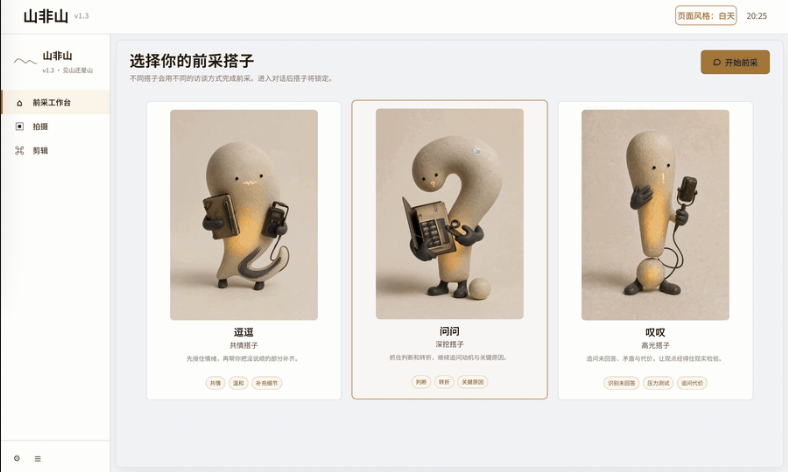
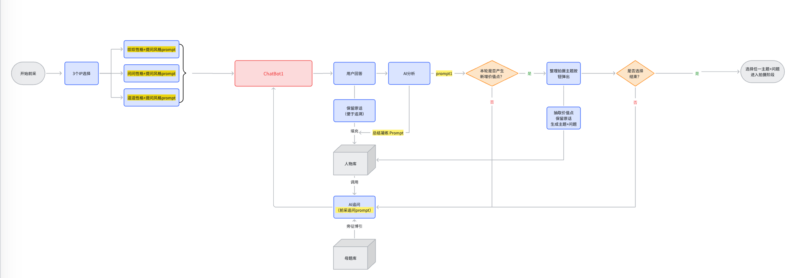
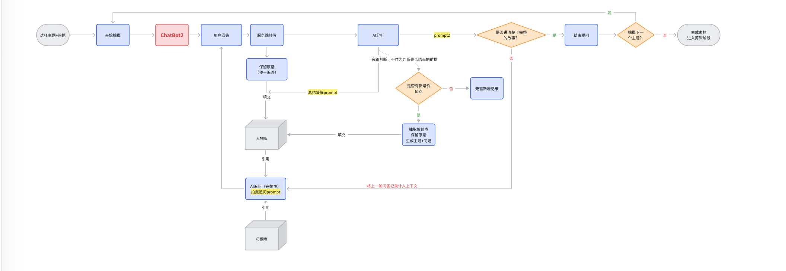
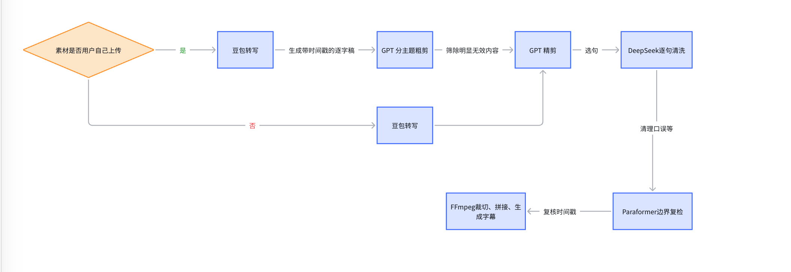

# 山非山 · TalkTake

**“聊聊天，立出片。”** 专为你而生的导演助手。

山非山（TalkTake）是一套面向内容创作者的 AI 自动导演工具。它把一条口播视频从「想说什么」到「可发布成片」的全过程串了起来：陪你聊出选题、生成采访提纲、用手机完成拍摄、自动回传素材，最后一键剪出成片。

## 产品 Demo

想先看看它怎么用、值不值得装？这条视频完整走了一遍从**前采对话到导出成片**的全流程：

▶ **[山非山产品演示](https://www.bilibili.com/video/BV1PGtm6mEDT/)**

## 下载

当前版本：**v0.1.6**

请前往 [Releases](https://github.com/Ander-XXX/TalkTake/releases/latest) 下载对应平台的安装包：

| 平台 | 安装包 | 适用设备 |
| --- | --- | --- |
| macOS | `山非山-0.1.6-arm64.dmg` | Apple 芯片（M1 / M2 / M3 / M4） |
| Windows | `山非山-win-0914-Setup.zip` | 64 位 Windows |

不确定该下载哪个：Apple 芯片 Mac 选 macOS 版本，Windows 电脑选 Windows 版本。当前版本不提供 Intel Mac 安装包。

## 安装

### macOS

1. 下载并打开 `山非山-0.1.6-arm64.dmg`。
2. 将「山非山」拖入 **Applications（应用程序）** 文件夹。
3. 从应用程序中启动山非山。

首次打开如果 macOS 提示无法验证开发者，请在 **系统设置 → 隐私与安全性** 中允许打开，然后重新启动应用。

### Windows

1. 下载并解压 `山非山-win-0914-Setup.zip`。
2. 运行解压目录中的安装程序，按向导完成安装。
3. 从开始菜单或桌面快捷方式启动山非山。

如果 Windows Defender 显示安全提示，请确认文件来自本仓库的 [Releases](https://github.com/Ander-XXX/TalkTake/releases) 页面后再继续。

## 核心功能

### 一、注册与登录

用手机号或邮箱注册账号并设置称呼即可开始使用。已有账号直接登录，忘记密码可以重置。

登录后进入左侧导航的工作区，包含 **前采工作台**、**拍摄** 和 **剪辑** 三个环节。

### 二、前采

前采是整个流程的起点：系统通过对话帮你想清楚“这条视频到底要讲什么”。

#### 2.1 选择前采搭子

团队调研了知名访谈博主的采访风格，提炼出三种性格不同的前采搭子，可以按自己的喜好选：

| 搭子 | 风格 | 适合 |
| --- | --- | --- |
| **逗逗** | 共情、温和、补充细节 | 想把一件事讲透、讲出情绪 |
| **问问** | 判断、转折、关键深挖 | 观点已经成型，想被追问到更深 |
| **叹叹** | 打破平衡、压力测试、追问代价 | 想验证一个观点站不站得住 |

搭子会影响整场对话的提问方式，进入对话后会固定下来。



#### 2.2 上传历史材料（可选）

可以把自己过往的爆款视频、文档、图片等一并喂进去，让 AI 在开始对话前就了解你。支持一次多选、批量上传。

- 文档和图片无数量上限
- 视频最多 3 条，单条不超过 15 分钟、不超过 2GB
- 不支持 Excel、PPT、音频等格式
- 不能上传空文件

上传的材料会参与人物库沉淀，**视频和文档会被拆解成可追溯的事实**，每条都带原文出处。

#### 2.3 前采对话

ChatBot 从「今天想聊聊什么」开始提问，然后按下面的循环推进：

1. **用户回答** — 系统完整记录你的原话并保留至人物库，便于后续追溯
2. **识别价值点** — AI 判断这一轮是否出现了新的经历、冲突、转折、独特观点或有价值的细节。没有就继续追问；有的话，会弹出「**整理拍摄方案**」按钮
3. **更新人物库** — 同时从你的回答中凝练身份、经历、能力、关系和观点
4. **下一轮追问** — 结合当前回答、人物库中的既有事实，并旁征博引母题库，生成自然的、有针对性的追问
5. **生成拍摄主题** — 每出现一条价值点，就整理出一条拍摄主题及对应的拍摄根问题

一次前采最多生成 **10 个主题**。确认主题后可以直接进入拍摄；不满意也可以「开始新的前采」继续挖掘。

> **人物库**：记录你的真实信息（身份、经历、能力、观点等），让 AI 更懂你，提问更个性化。
> **母题库**：为 AI 提供提问参考的公开题库，只读。

#### 2.4 前采流程图



### 三、拍摄

#### 3.1 拍摄流程图



#### 3.2 扫码连接手机

进入拍摄页后，PC 端会生成二维码，用手机扫码建立连接。PC 端负责扫码引导和接收素材，**拍摄过程全部在手机端完成**。

连接成功后，手机端显示当前主题与问题，按问题录制即可。PC 端会同步显示文本撰写内容与素材回传状态。

#### 3.3 手机端拍摄

- 每轮回答完成后点击「**我说完了**」，后台同步做内容分析与语义理解，并生成追问推回手机
- 跟着追问继续拍摄，直到这个主题的观点完整
- 拍摄全程 PC 端实时显示进度与回传状态

#### 3.4 结束拍摄

完成本轮主题后，可以选择 **下一个主题** 或 **结束拍摄**。确认结束拍摄后，素材会自动回传 PC 端并生成对应的视频项目，点击「开始剪辑」即可进入剪辑环节。

### 四、剪辑

#### 4.1 视频项目

拍摄完成后，素材自动回传并生成视频项目。项目列表展示素材封面、时长和处理状态，支持预览、修改和删除。

也可以点击「**新增素材**」导入额外的视频素材。

#### 4.2 智能剪辑

选择目标视频项目后点击「开始剪辑」，系统会结合拍摄阶段沉淀的 **主题、问答关系和内容结构** 对素材做自动整理和一键智剪。



#### 4.3 预览与调整

剪辑完成后可以在剪辑台预览效果并微调：

- 修改字幕样式
- 调整或修改字幕内容
- 切换滤镜
- 检查画面和整体播放效果

**编辑过程会自动保存**，不会因为误操作丢失调整。

#### 4.4 查看与导出成片

确认效果后选择「保存并导出全部」，生成最终可发布的视频文件。

导出的成片支持多平台一键发布，包括 **抖音、Bilibili、微信视频号、小红书** 等。导出完成后可以直接打开文件所在目录。

## 校验安装包

Release 页面提供每个安装包的 SHA-256 校验值。下载后可按下面的方式核对：

```bash
# macOS
shasum -a 256 山非山-0.1.6-arm64.dmg
```

```powershell
# Windows PowerShell
Get-FileHash .\山非山-win-0914-Setup.zip -Algorithm SHA256
```

计算出的值应与 Release 页面显示的值一致。

## 版本说明

### v0.1.6

- 首个公开发布版本
- 提供 macOS Apple 芯片和 Windows 64 位安装包

详细变更记录会随每个版本发布同步更新。

## 常见问题

**Q：macOS 提示「无法验证开发者」怎么办？**
在 **系统设置 → 隐私与安全性** 中，允许来自该开发者的应用打开，然后重新启动山非山。

**Q：Windows 提示安全警告怎么办？**
确认安装包来自本仓库的 [Releases](https://github.com/Ander-XXX/TalkTake/releases) 页面，核对 SHA-256 无误后继续安装。

**Q：拍摄阶段手机连不上怎么办？**
确认手机和电脑在同一网络下，然后重新生成二维码扫码。拍摄页的引导区会显示当前连接状态。

## 问题反馈

使用中遇到问题，请在 [Issues](https://github.com/Ander-XXX/TalkTake/issues) 提交反馈，并尽量附上：

- 操作系统及版本
- 山非山版本号
- 复现步骤和完整报错信息

## 许可

本项目的许可协议将在后续版本中补充。未经项目维护者书面许可，请勿将安装包用于再分发或商业售卖。
